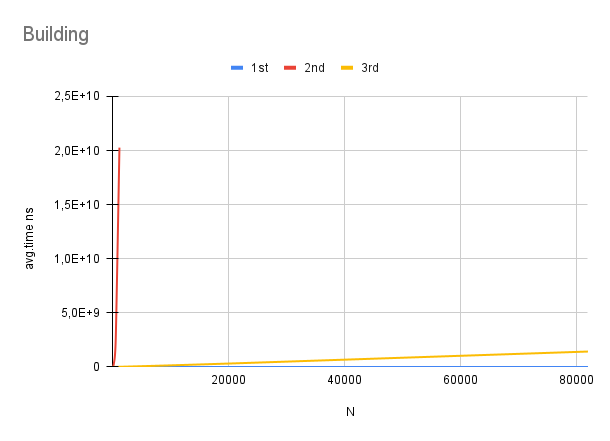
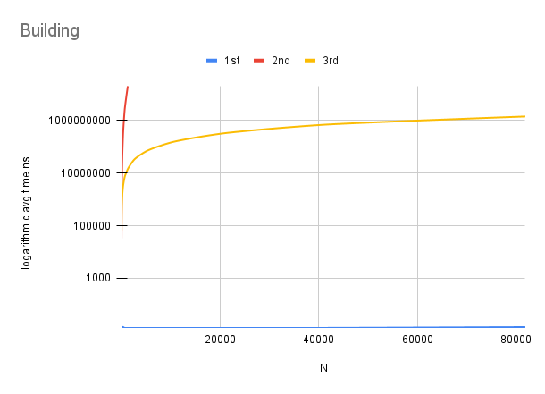
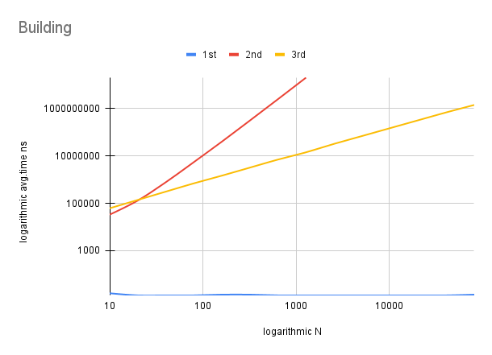
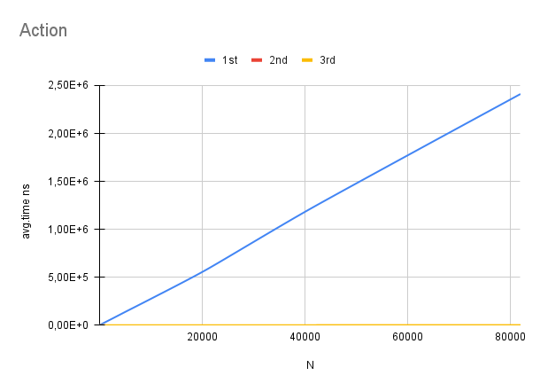
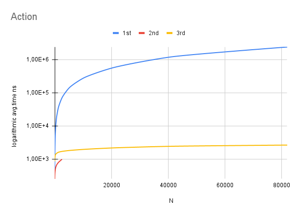
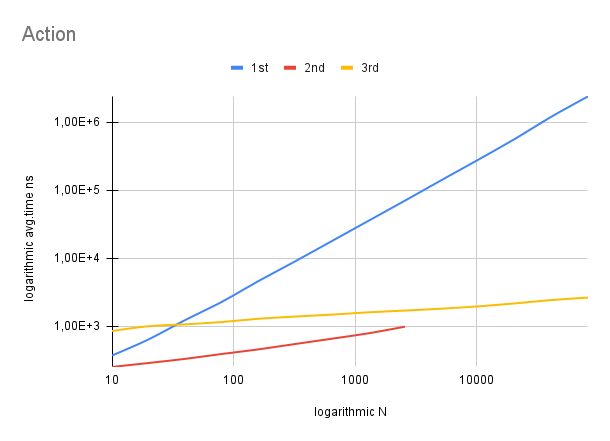

# Data Structures & Algorithms, practice work 2

# Results
Results of benchmarking can be found [here](results.txt)

# Graphs

On the graph above we can see how significant is the pace of growth of the 2nd `O(n^3)` algorithm.

Thanks to the graph above, we can come to conclusion that 3rd algorithm is much more complex than the first one. Also it's obvious that the 1st algorithm has `O(1)` time complexity for building and the 2nd has `O(nlogn)`.

We can highlight one interesting fact: the 2nd algorithm's building is, indeed, faster than the 3rd one's but it is only true until N reaches ~40. After that aforementioned algorithms change their 'positions'.

The sole purpose of that graph is to show that the 1st algorithm can answer requests in `O(n)`.

Using that graph we can see subtle difference between 2nd and 3rd algorithms. Nota Bene: it is not practically possible to build 2nd algorithm for N larger than ~4000 due to its time complexity.

The last graph shows that the 3rd algorithm gives less performance until N reaches ~80. I believe this difference is conditioned by the bigger constant in the 3rd algorithm's time complexity.
